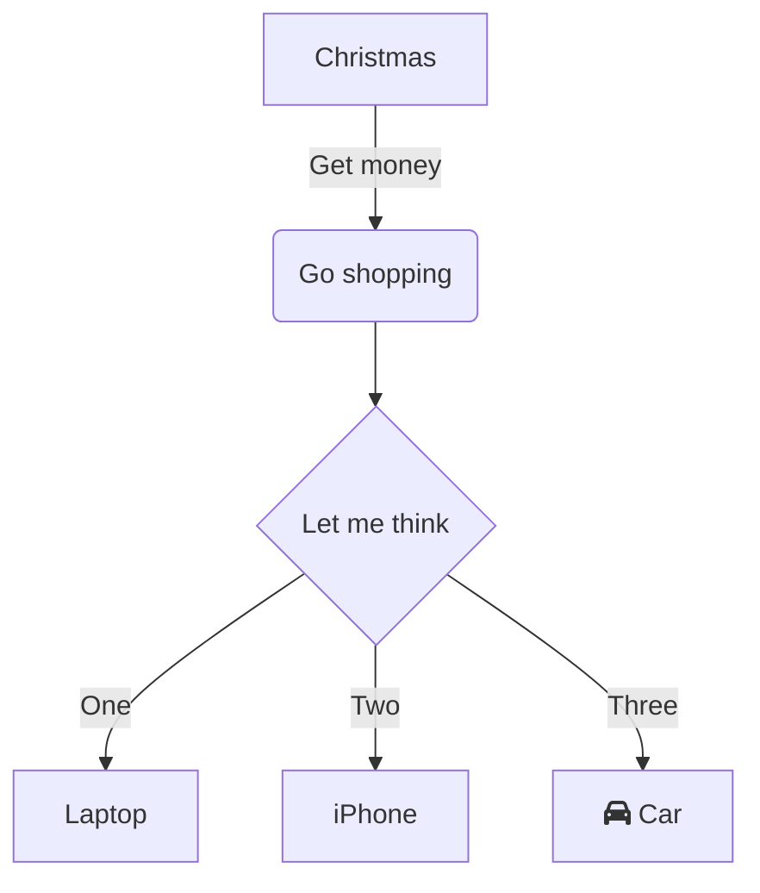
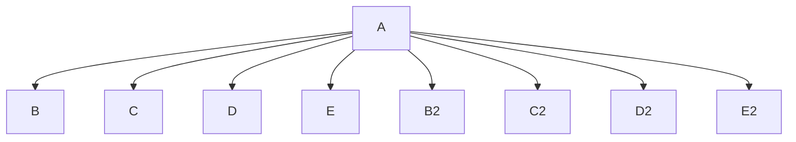

```mermaid
flowchart TD
    A[Christmas] -->|Get money| B(Go shopping)
    B --> C{Let me think}
    C -->|One| D[Laptop]
    C -->|Two| E[iPhone]
    C -->|Three| F[fa:fa-car Car]
```
  

```mermaid
  graph TD;
      A-->B;
      A-->C;
      A-->D;
      A-->E;
      A-->B2;
      A-->C2;
      A-->D2;
      A-->E2;
```
